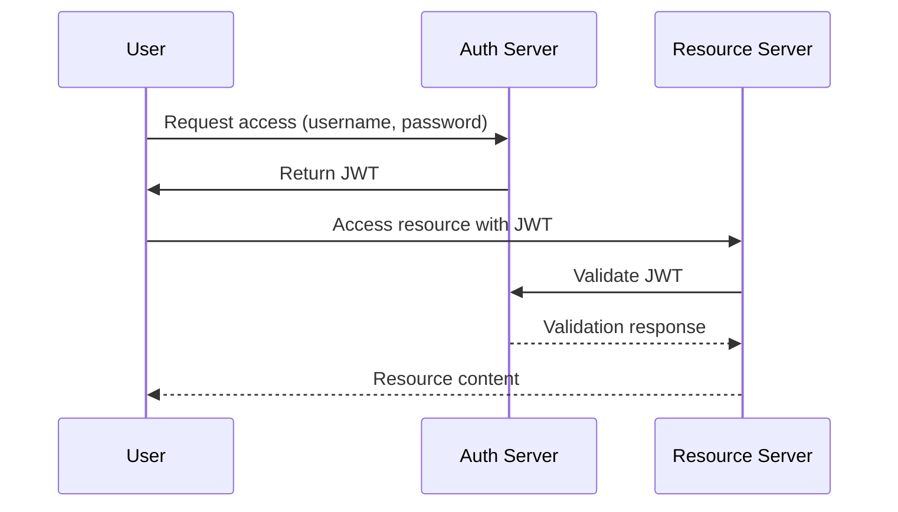

# Architecture Documentation for Spring Security + JWT + RBAC

## Overview  
This document provides a comprehensive overview of the architecture utilized in the Spring Security application, which uses JSON Web Tokens (JWT) and Role-Based Access Control (RBAC).

### Components  
1. **Spring Security**  
   A powerful and customizable authentication and access-control framework for Java applications.

2. **JWT (JSON Web Token)**  
   A compact, URL-safe means of representing claims to be transferred between two parties. The claims in a JWT are encoded as a JSON object that is used as the payload of a JSON Web Signature (JWS) structure.

3. **RBAC (Role-Based Access Control)**  
   A method of restricting network access based on the roles of individual users within an enterprise.

### Architectural Diagram  

### Workflow  
1. **User Authentication**  
   - User provides credentials (username and password).  
   - Auth Server validates credentials and generates a JWT if successful.

2. **JWT Validation**  
   - Resource Server validates the JWT with the Auth Server before granting access to resources.

3. **Access Control**  
   - Access to resources is determined based on the user’s roles encapsulated within the JWT.

### Security Considerations  
- Make sure to use HTTPS to protect JWT from interception.
- Set a reasonable expiration time for JWTs and implement token refresh mechanisms.

### Conclusion  
This document provides a high-level overview of the Spring Security application using JWTs with RBAC. It covers the architectural components, workflow, and security considerations necessary to implement a robust security framework.

---  
*Documentation generated on: 2026-02-08 16:47:13 UTC*